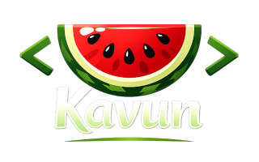

# Kavun



Kavun (кавун, watermelon) is a lightweight, high-performance, embeddable scripting language for Go, built around expression-oriented programming and consistent language design principles. Its feature set, including arrow-function lambdas, data-type member functions, and fluent chaining, enables transformation-heavy code to be written as clear expressions instead of loop-and-branch boilerplate. It runs on a bytecode VM implemented in Go, making embedding and sandboxing straightforward in Go services and tools.

## Quick Start

Install the cli with Go's toolchain:

```bash
go install github.com/jokruger/kavun/cmd/kavun@latest
```

Then you can run Kavun scripts with the `kavun` command or using hashbang:

```go
#!/usr/bin/env kavun

fmt = import("fmt")

result = [1, 2, 3, 4, 5, 6]
  .filter(x => x % 2 == 0)
  .map(x => x * x)
  .reduce(0, (sum, x) => sum + x)

fmt.printf("sum of even squares: %v\n", result)
```

## Documentation

- [Installing](docs/installing.md) - Instructions for installing the Kavun CLI.
- [Embedding](docs/embedding.md) - Guide to embedding the Kavun runtime in Go applications.
- [Language Reference](docs/language.md) - Syntax, expressions, statements, functions, modules, built-ins, and diagnostics.
- [Type Reference](docs/types.md) - Detailed builtin type semantics, conversions, and member functions.
- [Standard Library](docs/stdlib.md) - Overview of standard library modules and their APIs.
- [Project Structure](docs/project.md) - Explanation of the repository layout and development workflow.
- [Coding Conventions](docs/conventions.md) - Guidelines for code style and contributions.

## Contributing

Before contributing, please review [`docs/project.md`](docs/project.md) and [`docs/conventions.md`](docs/conventions.md) for project layout, coding standards and repository contracts.

1. Fork the repository and clone your fork locally.
2. Make your changes in a focused branch.
3. Run the test suite.
4. Add or update tests in `tests/unit` for any change that affects language or runtime behavior.
5. Open a pull request describing the motivation for the change and any new or changed semantics.

## License

This project is licensed under the MIT License. See the `LICENSE` file for details.

### Acknowledgements

This project is based on script language Tengo by Daniel Kang. A special thanks to Tengo's creator and contributors.