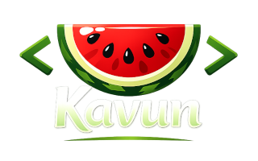

# Kavun



Kavun (кавун, watermelon) is a lightweight, high-performance, embeddable scripting language for Go, built around
expression-oriented programming and consistent language design principles. Its feature set, including f-strings,
arrow-function lambdas, data-type member functions, and fluent chaining, enables transformation-heavy code to be written
as clear expressions instead of loop-and-branch boilerplate. It runs on a bytecode VM implemented in Go, making
embedding and sandboxing straightforward in Go services and tools.

## Key Features

- **Dynamically typed**, with coercive equality (`1 == "1"`) and a small, predictable truthiness table.
- **Expression-oriented** — arrow lambdas (`x => x * 2`), fluent method chaining, `if`/`for` init statements
  sharing scope with their block.
- **Destructuring & parallel assignment** — `a, b = b, a`, `a, b, c = [1, 2, 3]`, `a, b = {a: 1, b: 2}`.
- **Placeholder syntax (`_`)** — `add(1, _, 3)` is sugar for `x => add(1, x, 3)`; see the
  [cheat sheet](docs/cheatsheet.md#placeholder-syntax-_).
- **f-strings & runtime format templates** — `f"n={n:5d}"`, plus `format(template, args)` for the same
  `{...}`/format-spec syntax at runtime.
- **`decimal` as a first-class type** — exact arithmetic for money, not a float workaround.
- **`defer`/`recover`** — Go-style cleanup and error handling without Go panics on the hot path.
- **Non-mutating by default** — collection methods return new values; `_in_place` and `freeze()` /
  `freeze_shallow()` are the explicit opt-ins.
- **Deterministic, single-threaded, sandboxable** — no goroutines/channels exposed to scripts, so embedding in
  finance, decisioning, and game-logic hosts stays reproducible and auditable.
- **AST-level optimizer** — purity-driven constant folding and dead-code elimination (see
  [purity contract](docs/purity.md)).

## Quick Start

Install the cli with Go's toolchain:

```bash
go install github.com/jokruger/kavun/cmd/kavun@latest
```

Or download a prebuilt binary from the [latest release](https://github.com/jokruger/kavun/releases/latest):

Then you can run Kavun scripts with the `kavun` command or using hashbang:

```go
#!/usr/bin/env kavun

fmt = import("fmt")

result = [1, 2, 3, 4, 5, 6]
  .filter(x => x % 2 == 0)
  .map(x => x * x)
  .reduce(0, (sum, x) => sum + x)

fmt.println(f"sum of even squares: {result}")
```

See more [examples](docs/examples.md), or the [cheat sheet](docs/cheatsheet.md) for a one-page syntax reference.

## Benchmark Results

Full benchmark results are available in the
[Kavun Benchmarks report](https://github.com/jokruger/kavun-benchmark/blob/main/results/REPORT.md).
A summary is shown below:

| Rank | Engine | CPU geomean | Avg rank | Worst ratio | Wins | Mem geomean | Tasks run | Missing |
|------|--------|-------------|----------|-------------|------|-------------|-----------|---------|
| 1 | kavun | 1.05× | 1.44 | 1.33× | 6 | 1.40× | 9 | 0 |
| 2 | gopherlua | 1.44× | 2.56 | 3.03× | 3 | 163.50× | 9 | 0 |
| 3 | golua | 1.51× | 3.33 | 1.85× | 0 | 228.44× | 9 | 0 |
| 4 | starlark | 2.32× | 4.11 | 5.56× | 0 | 158.82× | 9 | 0 |
| 5 | tengo | 2.94× | 4.33 | 44.34× | 0 | 1177.80× | 9 | 0 |
| 6 | goja | 4.87× | 6.22 | 11.91× | 0 | 297.35× | 9 | 0 |
| 7 | risor | 5.82× | 6.00 | 136.10× | 0 | 3102.55× | 9 | 0 |

## Documentation

- [Installing](docs/installing.md) - Instructions for installing the Kavun CLI.
- [Embedding](docs/embedding.md) - Guide to embedding the Kavun runtime in Go applications.
- [Language Reference](docs/language.md) - Syntax, expressions, statements, functions, modules, built-ins, and diagnostics.
- [Cheat Sheet](docs/cheatsheet.md) - One-page quick reference for syntax and key language features.
- [Type Reference](docs/types.md) - Detailed builtin type semantics, conversions, and member functions.
- [Standard Library](docs/stdlib.md) - Overview of standard library modules and their APIs.
- [Examples](docs/examples.md) - Short, runnable snippets showcasing key language features.
- [Virtual Machine](docs/vm.md) - Virtual machine specifics and limitations.
- [Coding Conventions](docs/conventions.md) - Guidelines for code style and contributions.

## Contributing

Before contributing, please review [`docs/conventions.md`](docs/conventions.md) for project layout, coding standards and
repository contracts.

1. Fork the repository and clone your fork locally.
2. Make your changes in a focused branch.
3. Run the test suite.
4. Add or update tests in `tests/unit` for any change that affects language or runtime behavior.
5. Open a pull request describing the motivation for the change and any new or changed semantics.

## License

This project is licensed under the MIT License. See the `LICENSE` file for details.

### Acknowledgements

This project is based on script language Tengo by Daniel Kang. A special thanks to Tengo's creator and contributors.
